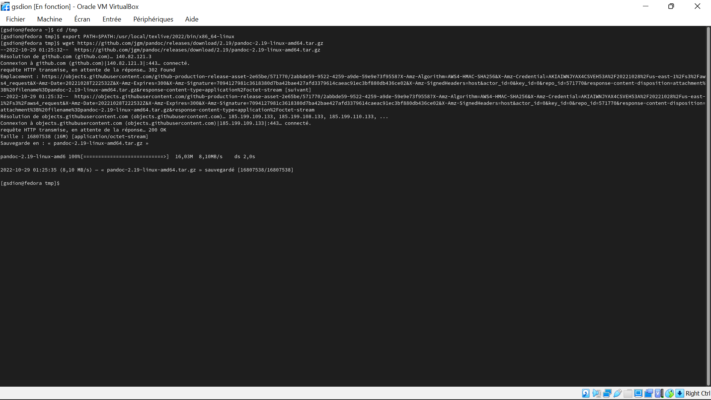

---
## Front matter
title: "Шаблон отчёта по лабораторной работе 4"
subtitle: "Простейший вариант"
author: "Дион Гонсан Седрик Мишель"

## Generic otions
lang: ru-RU
toc-title: "Содержание"

## Bibliography
bibliography: bib/cite.bib
csl: pandoc/csl/gost-r-7-0-5-2008-numeric.csl

## Pdf output format
toc: true # Table of contents
toc-depth: 2
lof: true # List of figures
lot: true # List of tables
fontsize: 12pt
linestretch: 1.5
papersize: a4
documentclass: scrreprt
## I18n polyglossia
polyglossia-lang:
  name: russian
  options:
	- spelling=modern
	- babelshorthands=true
polyglossia-otherlangs:
  name: english
## I18n babel
babel-lang: russian
babel-otherlangs: english
## Fonts
mainfont: PT Serif
romanfont: PT Serif
sansfont: PT Sans
monofont: PT Mono
mainfontoptions: Ligatures=TeX
romanfontoptions: Ligatures=TeX
sansfontoptions: Ligatures=TeX,Scale=MatchLowercase
monofontoptions: Scale=MatchLowercase,Scale=0.9
## Biblatex
biblatex: true
biblio-style: "gost-numeric"
biblatexoptions:
  - parentracker=true
  - backend=biber
  - hyperref=auto
  - language=auto
  - autolang=other*
  - citestyle=gost-numeric
## Pandoc-crossref LaTeX customization
figureTitle: "Рис."
tableTitle: "Таблица"
listingTitle: "Листинг"
lofTitle: "Список иллюстраций"
lotTitle: "Список таблиц"
lolTitle: "Листинги"
## Misc options
indent: true
header-includes:
  - \usepackage{indentfirst}
  - \usepackage{float} # keep figures where there are in the text
  - \floatplacement{figure}{H} # keep figures where there are in the text
---

# Цель работы
	Целью работы является освоение процедуры оформления отчетов с помощью
легковесного языка разметки Markdown.

# Задание
1. В соответствующем каталоге сделайте отчёт по лабораторной работе No 3
в формате Markdown. В качестве отчёта необходимо предоставить отчёты
в 3 форматах: pdf, docx и md.
2. Загрузите файлы на github

# Теоретическое введение

Markdown поддерживает как встраивание фрагментов кода в предложение,
так и их размещение между предложениями в виде отдельных огражденных
блоков. Огражденные блоки кода — это простой способ выделить синтаксис для
фрагментов кода.

# Выполнение лабораторной работы

Описываются проведённые действия, в качестве иллюстрации даётся ссылка на иллюстрацию (рис. [-@fig:001])

{ #fig:001 width=70% }

Процедура установки teX live (рис. [-@fig:002])

{ #fig:002 width=70% }

становка Pandoc и pandoc-crossref (рис. [-@fig:003])

{ #fig:003 width=70% }

Скачать архивы с исходными файлами.(рис. [-@fig:004])

{ #fig:004 width=70% }

Скопировать файлы pandoc и pandoc-crossref в каталог /usr/local/bin/:  (рис. [-@fig:005])

{ #fig:005 width=70% }

C помощью команды ls можно проверить корректность выполненных действий

# Выводы

	В конце этой лаборатории это позволило нам создать отчет о разметке с помощью языка легкой разметки markdown после различных загрузок.

# Список литературы{.unnumbered}

::: {#refs}
:::
