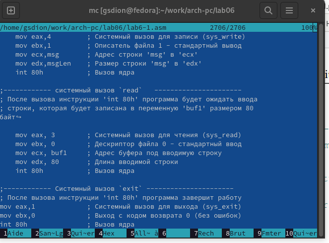

---
## Front matter
title: "Отчёта по лабораторной работе 6"
subtitle: "Основы работы с Midnight Commander (mc). Структура программы на языке ассемблера NASM"
author: "Дион Гонссан Седрик Мишель"

## Generic otions
lang: ru-RU
toc-title: "Содержание"

## Bibliography
bibliography: bib/cite.bib
csl: pandoc/csl/gost-r-7-0-5-2008-numeric.csl

## Pdf output format
toc: true # Table of contents
toc-depth: 2
lof: true # List of figures
lot: true # List of tables
fontsize: 12pt
linestretch: 1.5
papersize: a4
documentclass: scrreprt
## I18n polyglossia
polyglossia-lang:
  name: russian
  options:
	- spelling=modern
	- babelshorthands=true
polyglossia-otherlangs:
  name: english
## I18n babel
babel-lang: russian
babel-otherlangs: english
## Fonts
mainfont: PT Serif
romanfont: PT Serif
sansfont: PT Sans
monofont: PT Mono
mainfontoptions: Ligatures=TeX
romanfontoptions: Ligatures=TeX
sansfontoptions: Ligatures=TeX,Scale=MatchLowercase
monofontoptions: Scale=MatchLowercase,Scale=0.9
## Biblatex
biblatex: true
biblio-style: "gost-numeric"
biblatexoptions:
  - parentracker=true
  - backend=biber
  - hyperref=auto
  - language=auto
  - autolang=other*
  - citestyle=gost-numeric
## Pandoc-crossref LaTeX customization
figureTitle: "Рис."
tableTitle: "Таблица"
listingTitle: "Листинг"
lofTitle: "Список иллюстраций"
lotTitle: "Список таблиц"
lolTitle: "Листинги"
## Misc options
indent: true
header-includes:
  - \usepackage{indentfirst}
  - \usepackage{float} # keep figures where there are in the text
  - \floatplacement{figure}{H} # keep figures where there are in the text
---

# Цель работы

Целью работы является приобретение практических навыков работы в Midnight Commander. 
Освоение инструкций языка ассемблера mov и int.

# Задание

1. Создайте копию файла lab6-1.asm. Внесите изменения в программу (без
использования внешнего файла in_out.asm), так чтобы она работала по
следующему алгоритму:
• вывести приглашение типа “Введите строку:”;
• ввести строку с клавиатуры;
• вывести введённую строку на экран.

2. Получите исполняемый файл и проверьте его работу. На приглашение
ввести строку введите свою фамилию.

3. Создайте копию файла lab6-2.asm. Исправьте текст программы с исполь-
зование подпрограмм из внешнего файла in_out.asm, так чтобы она ра-
ботала по следующему алгоритму:
• вывести приглашение типа “Введите строку:”
• ввести строку с клавиатуры;
• вывести введённую строку на экран.

4. Загрузите файлы на GitHub.

# Теоретическое введение

Midnight  Commander - это программа, предназначенная для просмотра содержимого каталогов и выполнения основных функций управления файлами в UNIX-подобных операционных системах.

Главное  окно  программы  Midnight  Commander  состоит из трех полей. Два поля, называемые "панелями", идентичны по структуре и  обычно  отображают  перечни  файлов  и  подкаталогов 
каких-то  двух каталогов файловой структуры. Эти каталоги в общем случае различны, хотя, в частности, могут  и  совпасть.  Каждая  панель  состоит  из  заголовка,  списка  файлов  и информационной строки.

Третье поле экрана, расположенное в нижней части экрана, содержит командную строку текущей оболочки.  В  этом  же  поле  (самая  нижняя  строка  экрана)  содержится   подсказка   по 
использованию  функциональных клавиш F1 - F10. Самая верхняя строка экрана содержит строку горизонтального меню.  
Эта строка может не отображаться на экране; в этом случае доступ  к ней можно получить, щелкнув мышью по верхней рамке или нажав клавишу F9.

Панели  Midnight  Commander  обеспечивают  просмотр  одновременно  двух каталогов. 
Одна из панелей является активной  в  том  смысле,  что  пользователь  может  выполнять  некоторые операции  с отображаемыми в этой панели файлами и каталогами. 

# Выполнение лабораторной работы

1. С помощью функциональной клавиши F7 создайте папку lab06 и перейдите в созданный каталог рис. [-@fig:002])

{ #fig:002 width=70%, height=70% } 

2. Создадим  новый подкаталог с именем lab06 и в нем файл lab6-1.asm. рис. [-@fig:003])

{ #fig:003 width=70%, height=70% }

3. Введем в файл lab6-1.asm текст программы вывода сообщения на экран и 
ввода строки с клавиатуры (Листинг 1.). 
Создадим исполняемый файл и проверим его работу. (рис. [-@fig:004], [-@fig:005])

{ #fig:004 width=70%, height=70% }

{ #fig:005 width=70%, height=70% }

4. Скачали с туис доп файл, скопировали программу. (рис. [-@fig:006])

{ #fig:006 width=70%, height=70% }

5. копия файла in_out.asm, который должен находиться в том же каталоге, 
 что и файл программы, в котором он используется. (рис. [-@fig:007])
 
{ #fig:007 width=70%, height=70% }

6. Используйте функциональную клавишу F6, чтобы создать копию lab6-.
1.asm с именем lab6-2.asm. Выделите файл lab6-1.asm, нажмите кнопку
F6 , введите имя файла lab6-2.asm и нажмите кнопку. (рис. [-@fig:008])

{ #fig:008 width=70%, height=70% }

7. Введем в файл lab6-1.asm текст программы вывода сообщения на экран и 
ввода строки с клавиатуры (Листинг 2.). 
Создадим исполняемый файл и проверим его работу. (рис. [-@fig:010], [-@fig:011])

{ #fig:010 width=70%, height=70% }

{ #fig:011 width=70%, height=70% }

8. Внесем изменения в программу (без использования внешнего файла in_out.asm), 
так чтобы она работала по следующему алгоритму:  (рис. [-@fig:012], [-@fig:013])

* вывести приглашение типа “Введите строку:”;

* ввести строку с клавиатуры;

* вывести введённую строку на экран.

{ #fig:012 width=70%, height=70% }

{ #fig:013 width=70%, height=70% }

# Выводы

В заключение можно сказать, что данная лабораторная позволила нам научиться писать основные программы на ассемблере. Владение инструкциями по сборке mov и int.

# Список литературы{.unnumbered}

1. [Справочная система по языку Assembler](https://www.i-assembler.ru/25/Text/Structur.htm)
2. [Midnight Commander](https://midnight-commander.org/)
